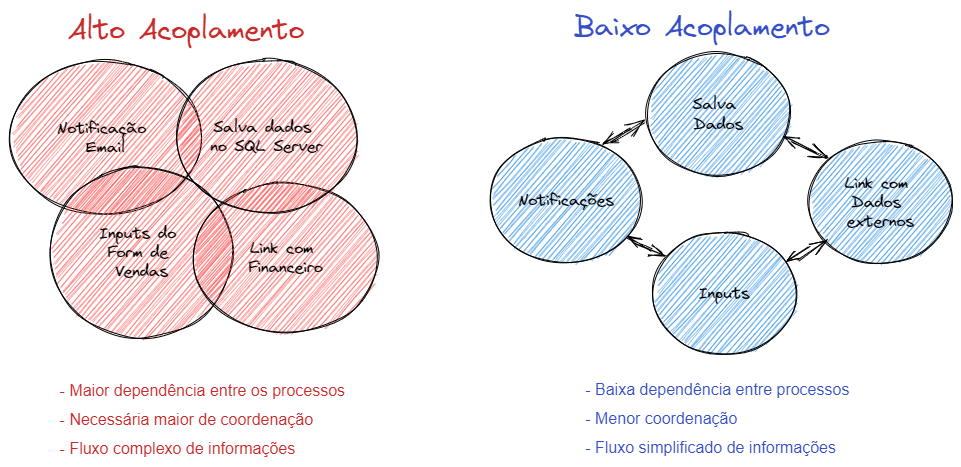
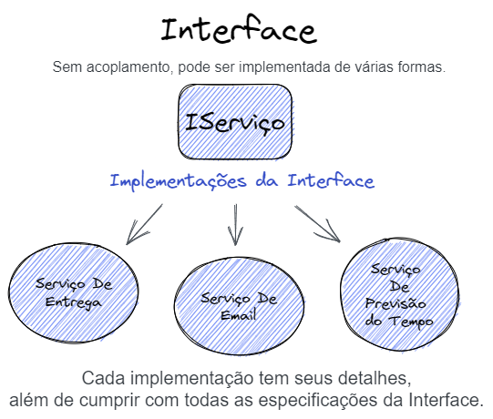
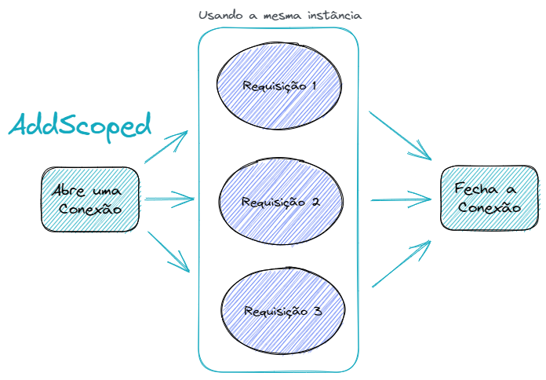

# Injeção de Dependência

Projeto para estudos e revisão de conceitos sobre DI ( Dependency Inversion ou Injeção de Dependência). [Curso balta.io](https://github.com/balta-io/2813)

## O que é Injeção de Dependência?

Esse termo é bem técnico e para simplificar: é uma técnica para implementar o padrão de **Inversão de Controle ou IoC**.

A **Injeção de Dependência** é o meio para chegar ao principio de design que é a **Inversão de Controle**.

Outro princípio que está relacionado a Injeção de Dependência é o **DIP (Princípio de Injeção de Dependência)**.

E pra que tudo isso?

A **Injeção de Dependência** ajuda no baixo acoplamento, separando o código em partes menores, onde cada parte tem somente uma responsabilidade.


[Devopedia](https://devopedia.org/dependency-injection)

Trabalhando com esse conceito, alterações e testes na aplicação são simplificados. Não temos a dependência de um banco de dados, um serviço, uma API ou trecho de código que nos deixe engessados.

## Baixo acoplamento

Acoplado é algo ligado, amarrado, travado, etc.
Ao pensar em um sistema empresarial grande com um ERP, não é viável fazer alterações em uma parte especifica como regras de vendas e ter que reescrever o sistema inteiro por conta dessa alteração.

O baixo acoplamento vem com esse pensamento, o sistema deve ser uma construção de componentes, onde cada pedacinho tem que focar em uma coisa específica. Ai sim, ao juntar esses pedacinhos, temos um conjunto trabalhando como um todo.

Esses componentes devem conseguir se comunicar, mas não devem depender uns dos outros.



No caso de algum componente parecer complexo, é ideal quebra-lo em partes menores.

Tudo tem que funcionar de forma independente. Fica mais fácil de entender, de fazer manutenção e se precisar apagar tudo e criar de novo, é de boa! 😎

A gestão da aplicação tem que ser organizada e simples.

## Vamos para o código

Um exemplo ruim (nesse contexto) de um Pedido Online:

```csharp
// Endpoint para gerar um pedido de compra online
public class OrderController : ControllerBase
{
    [Route("v1/orders")]
    [HttpPost]
    public async Task<IActionResult> Place(string customerId, string zipCode, string promoCode, int[] products)
    {
        // #1 - Recupera o cliente
        // Dependente do banco de dados
        Customer customer = null;
        await using (var conn = new SqlConnection("CONN_STRING"))
        {
            const string query = "SELECT [Id], [Name], [Email] FROM CUSTOMER WHERE ID=@id";
            customer = await conn.QueryFirstAsync<Customer>(query, new { id = customerId });
        }

        // #2 - Calcula o frete
        // Dependente da API para consultar o frete
        decimal deliveryFee = 0;
        var client = new RestClient("https://consultafrete.io/cep/");
        var request = new RestRequest()
            .AddJsonBody(new
            {
                zipCode
            });
        deliveryFee = await client.PostAsync<decimal>(request, new CancellationToken());

        // Complexidade ciclomática e código não blindado.
        // Esse parâmetro pode ser alterado a qualquer momento no fluxo de execução, tendo potencial
        // para gerar diversos pedidos com valores errados. Também há dificuldade para fazer testes.
        if (deliveryFee < 5)
            deliveryFee = 5;

        // #3 - Calcula o total dos produtos
        // Novamente uma dependência do banco de dados, consulta gastando recursos.
        decimal subTotal = 0;
        const string getProductQuery = "SELECT [Id], [Name], [Price] FROM PRODUCT WHERE ID=@id";
        for (var p = 0; p < products.Length; p++)
        {
            Product product;
            await using (var conn = new SqlConnection("CONN_STRING"))
                product = await conn.QueryFirstAsync<Product>(getProductQuery, new { Id = p });

            subTotal += product.Price;
        }

        // #4 - Aplica o cupom de desconto
        // Novamente uma dependência do banco de dados, consulta gastando recursos.
        // Código não blindado, com potencial para gerar pedidos com valores errados de desconto.
        decimal discount = 0;
        await using (var conn = new SqlConnection("CONN_STRING"))
        {
            const string query = "SELECT * FROM PROMO_CODES WHERE CODE=@code";
            var promo = await conn.QueryFirstAsync<PromoCode>(query, new { code = promoCode });
            if (promo.ExpireDate > DateTime.Now)
                discount = promo.Value;
        }

        // #5 - Gera o pedido
        // Não houveram validações anteriores para retornar rapidamente em caso de erro.
        // Toda execução até aqui foi feita sem validação, gastando recursos.
        var order = new Order();
        order.Code = Guid.NewGuid().ToString().ToUpper().Substring(0, 8);
        order.Date = DateTime.Now;
        order.DeliveryFee = deliveryFee;
        order.Discount = discount;
        order.Products = products;
        order.SubTotal = subTotal;

        // #6 - Calcula o total
        // Código não blindado, alguém pode vir aqui e dar um golpe, alterando os valores na mão.
        order.Total = subTotal - discount + deliveryFee;

        // #7 - Retorna
        // Só retorna no último passo. E se houver alguma falha? o único tratamento será o padrão
        // de exceção lançado via stack, que é mais complexo para analisar os erros.
        return Ok(new
        {
            Message = $"Pedido {order.Code} gerado com sucesso!"
        });
    }
}
```

Entre os problemas listados nos comentários, ainda temos:

- Dificuldade na leitura do código.
  São muitas linhas para analisar, pois todas as regras de negócio estão concentradas dentro desse controller.

- Dificuldade para realizar mudanças no código.
  Está tudo amarrado, olha o alto acoplamento ai 😢. E se a API que retorna o CEP mudar o retorno ou estiver fora? qual a alternativa?

- Código não é reusável.
  Se for necessário implementar em outras partes do sistema regras parecidas, será feito da forma velha e conhecida `copia e cola` 😄.

- Casos de testes complexos.
  Para fazer testes, seria necessário executar todo fluxo em produção ou criar um ambiente de testes para executar.
  Claro que uma aplicação pequena e bem especifica é viável, mas para cenários com aplicações maiores como um ERP, que não podem parar, ou aplicações de missão crítica como linha de produção, aparelhos de precisão com radiação que não podem receber dados inválidos, fica complicado.

## Como resolver com Orientação a Objetos?

Separando as regras de negócio em classes, com cada assunto no seu lugar!

```csharp
public class DeliveryService
{
    public async decimal GetDeliveryFee(string zipCode)
    {
        var request = new HttpRequestMessage(HttpMethod.Get, "url/" + zipCode);
        request.Headers.Add("Accept", "application/json");
        request.Headers.Add("User-Agent", "HttpClientFactory-Sample");

        using (HttpClient client = new())
        {
            var response = await client.SendAsync(request);
            if (response.IsSuccessStatusCode)
            {
                deliveryFee = await response.Content.ReadAsAsync<decimal>();
            }
            else
            {
                deliveryFee = 5;
            }
        }
    }
}
```

Agora temos uma classe com as regras para o ServiçoDeEntrega. Com isso só temos vantagens:

- Abstração e Encapsulamento do código.
- Ficou simples e direto acessar a regra de negócio.
- Pedaço pequeno de código.
- O código pode ser reusado em outros fluxos quando necessário.
- É fácil testar.
- Se for necessário alterar o código, só é preciso mexer em um único local, replicando pra toda aplicação.

Ainda sim, o código apenas mudou de lugar, há questões a serem melhoradas como a dependência do serviço.

```csharp
public class OrderController : Controller
{
    [Route("v1/orders")]
    [HttpPost]
    public async Task<string> Place(
        string customerId,
        string zipCode,
        string promoCode,
        int[] products
    )
    {
        ...
        // Ao invés de estar acoplado com o HttpClient, está amarrado com o deliveryService
        var deliveryService = new DeliveryService();
        decimal deliveryFee = DeliveryService.GetDeliveryFee(zipCode);
        ...
    }
}
```

O conceito é: **não podemos ter dependências acopladas**. Trabalhando dessa forma não é possível fazer testes e outras modificações de forma fácil.

## IoC ou Inversão de Controle

Inverta as dependências! A inversão de controle basicamente é criar responsabilidades externas.

Ao invés do Controller depender do serviço, fazemos o controlador receber um serviço externo no seu construtor.

Assim, não é possível criar uma nova instancia de serviço no Controller e fazer manipulações. Apenas trabalhamos com o serviço recebido via parâmetro no construtor.

```csharp
public class OrderController : Controller
{
    private readonly DeliveryService _deliveryService;

    // Agora temos apenas o serviço injetado no código.
    // Não são criados novos objetos do tipo DeliveryService
    OrderController(DeliveryService deliveryService)
    {
        _deliveryService = deliveryService;
    }

    [Route("v1/orders")]
    [HttpPost]
    public async Task<string> Local(
        string customerId,
        string zipCode,
        string promoCode,
        int[] products
    )
    {
        ...
        decimal deliveryFee = _deliveryService.GetDeliveryFee(zipCode);
        ...
    }
}

// O teste fica bem simples.
[TestMethod]
// Deve fazer um pedido.
public void ShouldPlaceAnOrder()
{
    var service = new DeliveryService();
    var controller = new OrderController(service);
}
```

## Abstração e Implementação

Ainda sim, pensando no DeliveryService, temos a dependência de sua implementação.

O ideal nesse caso é depender da abstração. Só é preciso definir criar as definições do serviço.

Para fazer essa separação no .NET, podemos pensar na **Abstração como Interfaces** e a **Implementação como Classes**.

Resumindo:

Abstração do código | **Interface**. Definição do **QUE** será feito, como se fosse um contrato com requisitos a serem cumpridos. A Interface pode ter várias implementações e é menos acoplada.

Código concreto | **Implementação**. Definição de **COMO** será feito, aplicando todos os passos e detalhes necessários para realização. A classe com a implementação não varia, sendo uma versão real e acoplada.



De maneira geral, pode-se dizer que a **interface** é a declaração de um conjunto de métodos que uma classe deve implementar, sem se preocupar com a implementação concreta desses métodos. A **implementação**, por sua vez, é o código real que executa as ações definidas na interface.

Essas duas definições são fundamentais em OOP, pois permitem separar a **definição da funcionalidade** de sua **implementação**, tornando o código mais modular, reutilizável e mais fácil de manter e atualizar.

Nem tudo precisa de interfaces, é mais uma ferramenta a ser utilizada.

## Por que abstrair?

Ao depender da abstração, não haverá necessidade de se preocupar com a implementação em diversos locais do código. Seja obcecado por abstração.

Aqui temos uma flexibilidade para mudanças, como por exemplo, trocar o SqlServer por Oracle ou MariaDB. Outro exemplo, uma troca da Nuvem AWS para Azure.

Basta informar qual será o banco utilizado. A classe especifica que faz a implementação para trabalhar com o banco de dados irá possuir todos os passos para fazer a manipulação dos dados.

Ao criar casos de testes, não podemos ter dependência de um banco de dados especifico, depender de conexão de rede, envio de email, consulta de API, ou seja, nada que fique amarrado. Tudo poderá ser simulado no teste de forma simples e funcional.

## Princípio da Inversão de Dependência ou DIP

O **Dependency Inversion Principle** é o princípio para depender de abstração e não implementação.

Ao invés de começar desenvolvendo o serviço de entrega no código, iniciamos pela interface. Com base nas definições da interface, temos as instruções do que vamos fazer na implementação ao desenvolver o serviço de entrega.

```csharp
// Interface IServicoDeEntrega. Definimos quais as ações obrigatórias devem ser implementadas.
public interface IDeliveryService
{
    decimal GetDeliveryFee(string zipCode);
}

// Classe com a implementação da interface. Os métodos obrigatórios serão implementados com detalhes.
public class DeliveryService : IDeliveryService
{
    public decimal GetDeliveryFee(string zipCode)
    {
        // Implementação com todos os cálculos e detalhes da taxa de entrega
    }
}

// Voltando ao exemplo do controlador de pedido, passamos a depender
// apenas da abstração e não mais da implementação.
public class OrderController
{
    private readonly IDeliveryService _deliveryService;

    // O construtor recebe um deliveryService abstrato
    public OrderController(IDeliveryService deliveryService)
    {
        _deliveryService = deliveryService;
    }
    ...
}

// Com essa simples mudança, podemos simular facilmente mocks para testes com uma implementação fake.
// Vamos criar uma classe com implementação de serviço de entrega de mentirinha.
// Ao informar o CEP, o valor do frete retornado é 10.
public class FakeDeliveryService : IDeliveryService
{
    public decimal GetDeliveryFee(string zipCode)
    {
        return 10;
    }
}

// Classe para testes de Pedidos
// O teste simulado deve gerar um pedido, passando o serviço de entrega fake,
// que tem em sua implementação o retorno 10, informando qualquer CEP.
// Se quiser testar qualquer outro serviço, só é preciso trocar a classe FakeDeliveryService.
[TestClass]
public class OrderTests
{
    [TestMethod]
    public void ShouldPlaceAnOrder()
    {
        IDeliveryService service = new FakeDeliveryService();
        var controller = new OrderController(service);
    }
}
```

## Service Locator e DI no ASP.NET

O Service Locator faz o DE/PARA das dependências criadas. Apenas correlaciona qual interface será implementada pela aplicação. Para isso, temos 3 formas padrão:

**AddTransient** | Sempre cria uma nova instancia do objeto. Ideal nos cenários onde queremos esse comportamento de sempre gerar um novo objeto.

```csharp
// DE/PARA: IDeliveryFeeService será implementado por DeliveryFeeService
builder.Services.AddTransient<IDeliveryFeeService, DeliveryFeeService>();
```

Exemplo de uso: criar um objeto temporário para fazer um cálculo e depois descartar esse objeto.

**AddScoped** | Cria um objeto por transação. Enquanto uma requisição for recebida e estiver fazendo o fluxo de execução, o objeto irá existir.

```csharp
builder.Services.AddScoped<IDeliveryFeeService, DeliveryFeeService>();
```

Então, se for feita uma chamada para mais serviços que dependem do mesmo objeto na requisição, o retorno será sempre a mesma instancia do objeto. Não será criada uma nova instancia até o fim da requisição.

Exemplo de uso: Trabalhar com banco de dados. Não é uma boa prática criar várias conexões com banco de dados na mesma transação, pois consomem muitos recursos de conexão, latência, tráfego e processamento.

Não faz sentido ir até o banco, abrir uma nova conexão, solicitar uma informação, processar e retornar uma informação parcial, depois abrir e fechar uma nova conexão, e retornar mais uma parte da informação. Isso deixa a aplicação mais lenta.

O cenário ideal é abrir uma conexão, fazer várias requisições com a mesma conexão e fechar a conexão.



**AddSingleton** | Padrão que garante a criação de apenas uma instância de objeto para toda aplicação. Uma vez criado o objeto, só é possível alterar reiniciando a aplicação.

```csharp
builder.Services.AddSingleton<IDeliveryFeeService, DeliveryFeeService>();
```

Exemplo de uso: carregar as configurações da aplicação na memória.

Um 4º tipo especial derivado de Scoped e exclusivo do ASP.NET é o **AppDbContext**.

**AppDbContext** | Utilizado exclusivamente com o EntityFramework e recomendado pela Microsoft. Garante que a conexão dure até o fim da requisição.

```csharp
builder
    .Services
    .AddDbContext<BlogDataContext>(x => x.UseSqlServer(ConnectionString));
```

## Resumo dos conceitos

**DI** | Dependency Inversion ou Injeção de Dependência, é uma técnica que aplica o princípio de design chamado de IoC ou Inversão de Controle.

**IoC** | Inversion of Control ou Inversão de Controle, é um padrão de design que propõe o desacoplamento, externalizando os itens internos para dependências externas. Exemplo: gera dependências externas para controladores na aplicação.

**DIP** | Dependency Inversion Principle ou Princípio da Inversão de Dependência, diz que devemos depender das abstrações e não das implementações, facilitando a vida na hora de fazer testes.

**Service Locator** | Responsável pelo DE/PARA dizendo qual serviço deve ser carregado dada a interface no ASP.NET.
